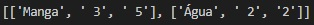
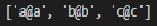
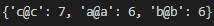
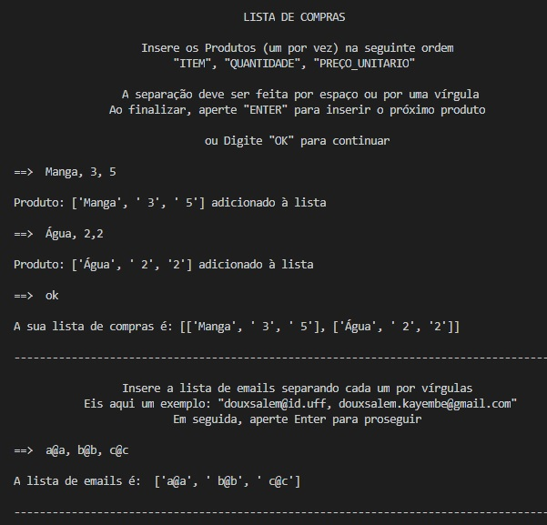
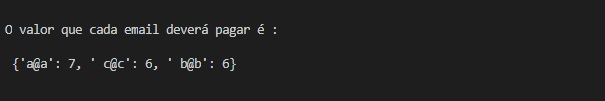
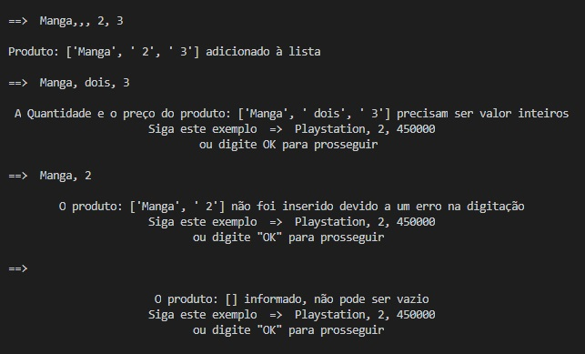
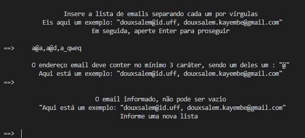
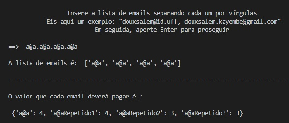

### DESAFIO ELIXIR STONE [<span style="color:gray">DOUX SALEM K.</span>][linkdomeusite]

#####**_Este <span style="color:green">Documento</span> contém explicações detalhadas sobre o código desenvolvido e as suas funcionalidades_**

**Assuntos abordados:**
##### - BREVE RESUMO
##### - TRATAMENTO DE ERROS
##### - COMO INSTALAR E UTILIZAR O PROGRAMA
##### - META

```
Sinta-se a vontade para perguntar sobre qualquer informação suplementar.
```

####**BREVE RESUMO**

######O programa é criado para receber uma lista de compras do usuário, uma lista de email, e dividir o valor total da compra de forma mais equilibrada e justa.

#####Exemplo:


In: lista de compras| In: lista de emails| Out: Dicionário 
--------|-|-------
||


####**TRATAMENTO DE ERROS**

######Nesta secção analisaremos de forma detalhada as funcionalidades do programa.

```
FUNCIONAMENTO DO PROGRAMA

As imagens embaixo descrevem o funcionamento com mais detalhes.

Ao iniciar o programa, uma mensagem de instrução orientando sobre como inserir as lista de compras é exibida na tela.

Após gerar a lista de compras, uma segunda instrução sobre como inserir a lista de emails é exibida na tela.

Ao finalizar, o dicionário contendo como chave os email e como valor, a quantia que deverá pagar é exibida.
```




######Com o intuito de melhorar o desempenho do programa, tratei alguns erros comum relacionados a entrada de dados.

```
Note que: Uma mensagem detalhando qual a natureza do erro cometido é sempre retornado ao usúario, sem interomper o programa.
```
```
ERROS NA ENTRADA DA LISTAS DE COMPRAS:

- SEPARADOR:
  Entrada do tipo: [ITEM,, QUANT,,, VALOR] será tratado automaticamento como [ITEM,QUANT,VALOR].

- VALOR NÃO INTEIRO PARA A QUANTIDADE E O VALOR:
  A mensagem de erro:
   "A Quantidade e o preço do produto: [ENTRADA RECEBIDA] precisam ter valores inteiros'.
    Siga este exemplo  =>  Playstation, 2, 450000".'ou digite OK para prosseguir

- FALTA DE UM DADO: ex: [Manga, 2]
  A mensagem de erro:
   "O produto: [ENTRADA RECEBIDA] não foi inserido devido a um erro na digitação.
    ...ou digite "OK" para prosseguir"

- ENTRADA VAZIA: [] 
   "O produto: [ENTRADA RECEBIDA] informado, não pode ser vazio'
   ...'ou digite "OK" para prosseguir"

- COMANDO "OK":
  São reconhecidos como comando "OK" essas entradas: "OK", "oK", "OK", "ok"
```
######Simulação do erro:



```
ERROS NA ENTRADA DA LISTAS DE EMAILS:

Para simular de forma correta a entrada de um email, foi requisitado a obrigação do caráter "@" para delimitar o nome de usúario
e o endereço do provedor.

A seguinte é exibida na ausencia do "@":
 "O endereço email deve conter no mínimo 3 caráter, sendo um deles um : "@"
  Aqui está um exemplo: "douxsalem@id.uff, douxsalem.kayembe@gmail.com"

- LISTA DE EMAIL VAZIA:
  A mensagem de erro:
  "O email informado, não pode ser vazio'
   Aqui está um exemplo: "douxsalem@id.uff, douxsalem.kayembe@gmail.com"
   Informe uma nova lista".

```
######Simulação do erro:


```
ERRO DE REPETIÇÂO DE CHAVE [EMAIL REPETIDO]:

Para cada repeticão de um endereço de email, o é acrecentado ao final do nome do email "repetidoX" com X o numero de vez repetido.
```


####**COMO INSTALAR E UTILIZAR O PROGRAMA**
######O Programa está escrito na linguagem python.
```
Ele é constituido de 3 arquivos python (Desafio_Doux.py, funcoes.py, mensagem.py)

Para rodar o programa, é preciso executar o arquivo Desafio.py em um compilador.

Os 3 arquivos precisam estar no mesmo diretório. Pois mensgam.py e funcoes.py são usados como módulos para Desafio.py

- Desafio.py:
  É o arquivo main.
  Ele chama as funções de mensagem.py e funcoes;py e contém a classe Desafio que recebe a lista de compras e email para retornar o
  dicionário requerido.
 
- mensagem.py:
  Módulo que contém todas as mensagens a serem exibidas na tela.

- funcoes.py
  Módulo que contém as funções: geralistacompra() e geralistaemail() para gerar as diferentes listas.

```


# Meta

#####Programa desenvolvido por [<span style="color:gray">DOUX SALEM KAYEMBE</span>][linkdomeusite] como teste técnico para o programa de formção elixir da STONE.

#####ESCRITO NA LINGUAGEM: PYTHON 3.6.0

#####Contato: [+5521979913295, douxsalem.kayembe@gmail.com]